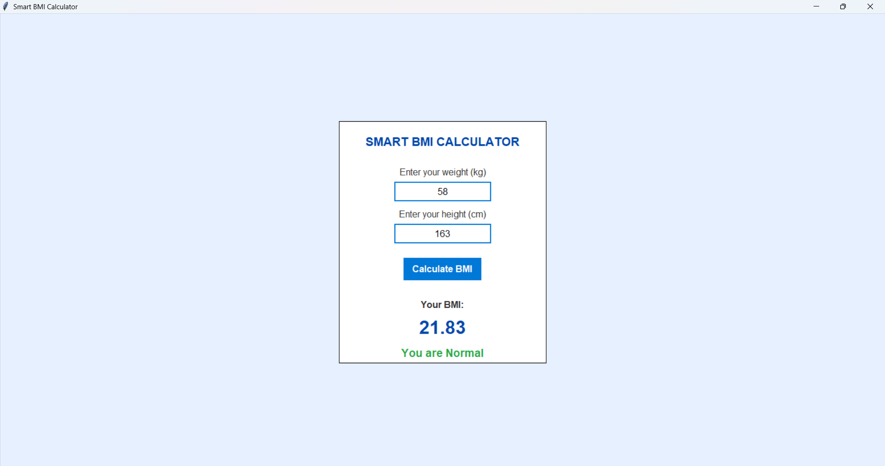

💪 Smart BMI Calculator (Tkinter)
🧠 Overview

The Smart BMI Calculator is a simple and elegant desktop application built using Python’s Tkinter library.
It allows users to calculate their Body Mass Index (BMI) by entering their height and weight.
The app instantly displays both the BMI value and the health category (Underweight, Normal, Overweight, or Obese) — all in a clean, modern GUI.

🎨 Features

🖥️ User-friendly Interface – Built with Tkinter and a modern, centered layout

📏 Instant BMI Calculation – Calculates BMI from user input (height & weight)

💬 Smart Status Display – Shows health status like “Normal 😊” or “Overweight 😐”

🎨 Rounded Stylish Button – Custom-designed rounded “Calculate” button

⚠️ Error Handling – Prompts users for valid numeric input

🧩 Lightweight & Offline – No backend or external libraries needed

🧮 BMI Formula
BMI
=
weight (kg)
(
height (m)
)
2
BMI=
(height (m))
2
weight (kg)
​

🚀 How to Run

Clone or download this repository

Make sure Python (≥3.8) is installed

Run the program:

python bmi_calculator.py

Enter your height (cm) and weight (kg), then click Calculate BMI

### Output

📸 GUI Preview

🛠️ Tech Stack

Language: Python

Library: Tkinter (built-in GUI library)

